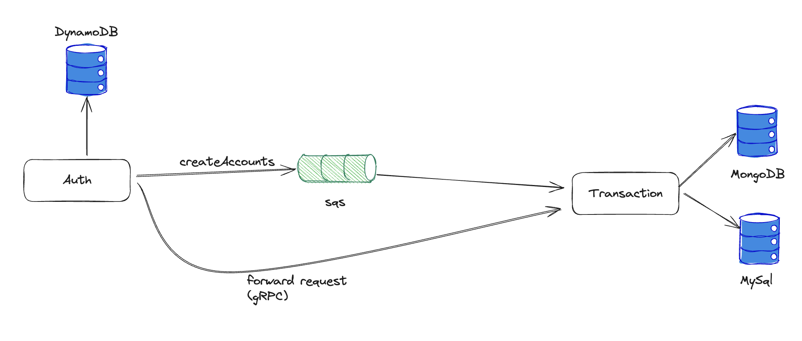

# Wallet

## Architecture



## Installation

You should run the following command:

```
docker compose up -d
```

## Usage

You can import the Postman collection in the `/docs` folder at the root of the project.

## Improvements

I would like to add the following improvements:

- [ ] Logging (Pino)
- [ ] Error handling per layer
- [ ] Unit and integrations tests
